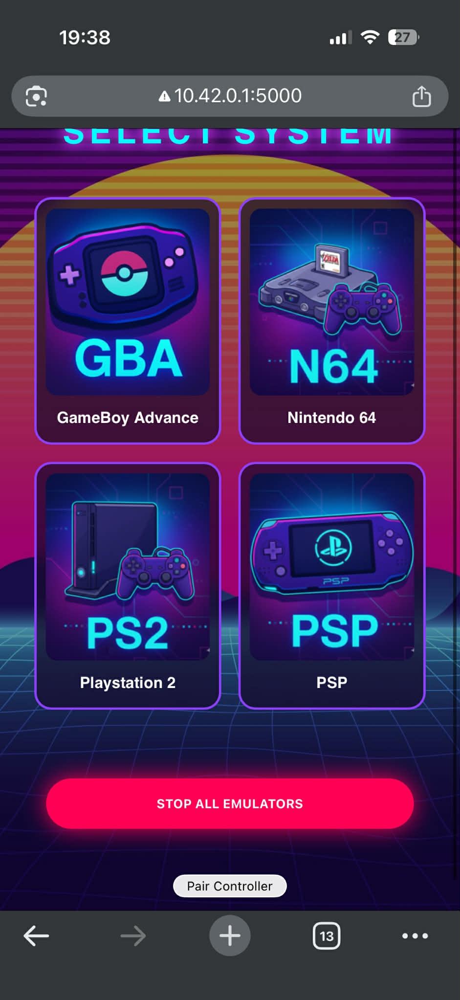

# My Retro OS (Pi 5)

A custom Yocto-based Linux distribution for the Raspberry Pi 5 for future emulation and streaming platform.

## Repository Structure
* **`meta-my-retro/`**: My custom Yocto layer
* **`kas-project.yml`**: Build file

## Prerequisites

1.  **System Dependencies**: Ensure your host machine (Ubuntu 24.04 recommended) has the standard Yocto dependencies installed.
2.  **Install Kas**:
    ```bash
    sudo apt update && sudo apt install pipx
    pipx install kas
    ```
## Build image
    kas build kas-project.yml

## Binding dualsense
You can bind your PS5 Dualsense (Perhaps some other controllers supported too) if you change the MAC adress in the .py file: /usr/bin/auto-pair.py

    python3 /usr/bin/auto-pair.py

The button that does this script call is inside the webserver on the button Pair Controller. All you needto do is put your controller into pairing mode and then click this button. The py script will handle all the neccessary steps to communicate the bind and driver to retroarch emulation cores.

## Webserver
Webserver 1.0 Currently there exists a webserver running on the pi as a 
remote control for basic operations towards the pi: Bluetooth connection/pairing  with your controller, Starting the games you have transferred, turning them off and moving around emulation categories.



The webserver can be accessed via default IP available on the raspberrypi: 10.42.0.1:5000. 

## Bluetooth connection

You can connect your controller via bluetooth but unfortunately now it's for my controller only as it's a passion project. The MAC adress of the controller is written in the service and needs to be adapted. This will be resolved in the future to support actual pairing and different devices.

## Running emu

You can run your games through the webserver but there is also a more manual debug option with -v flag on retroarch.

Currently you can run emu by using this command as root in debug image (also you need to copy your ROM files).

    cd /usr/
    retroarch -L mgba_libretro.so games/your_game.gba

## Playing the games
All that's neccessary is that the raspberrypi is on and hdmi connected to the HDMI device. The game will stream there. Pi has no need to connect to the internet but if connected to the router via eth cable, it will provide internet access as well to the connected devices. 

## Legal Disclaimer

This project is intended for educational and private use only.

**No Firmware/BIOS Included:**

 This repository does not host, distribute, or provide any proprietary system files, firmware, or BIOS images. This includes, but is not limited to:

  * Sony PlayStation: scph5500.bin, scph5501.bin, scph5502.bin, etc.

  * Nintendo Systems: System firmware, IPL.bin, font_*.bin, or cryptographic keys (prod.keys, title.keys).
* **No Game ROMs/ISO:** No copyrighted game software is included in this repository. I do not condone, encourage, or support the use of pirated software. Users must provide their own legally obtained game backups. 

**DMCA & Anti-Circumvention**

* These recipes are instructions for compiling open-source software. They do not contain "circumvention tools" designed to bypass Technological Protection Measures (TPMs) as defined by the Digital Millennium Copyright Act (DMCA).

**Trademarks:** 
* All product names, logos, and brands are the property of their respective owners:

    Sony® and PlayStation® are registered trademarks of Sony Interactive Entertainment Inc.

    Nintendo® and all associated console names (NES, SNES, N64, GameCube, Wii, Switch) are trademarks of Nintendo Co., Ltd.

    This project is an independent open-source endeavor and is not affiliated with, authorized, or endorsed by Sony or Nintendo.