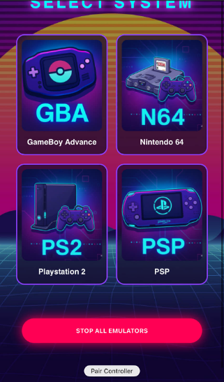
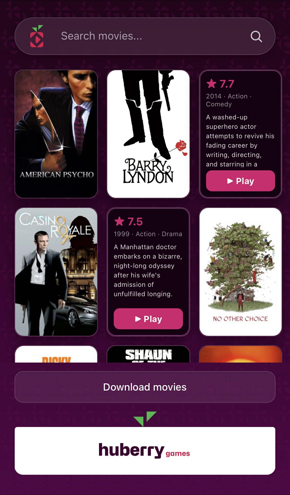

# My Retro OS (Pi 5)

<p align="center"></p>

A custom Linux image for the Raspberry Pi 5 that turns it into a self-contained retro gaming and movie streaming box. No monitor, keyboard, or internet connection required (except for storing the movies/games), everything is controlled from your phone through a WiFi hotspot broadcast by the Pi itself.

## What it does

- **Retro gaming** - Launch games across multiple classic consoles directly from your phone's browser
- **Movie streaming** - Download and play movies to the TV via a phone-friendly web remote (see [webserver-videoplayer](https://github.com/Gilgameshgb-1/webserver-videoplayer))
- **Controller pairing** - Pair your PS5 DualSense wirelessly with one tap from the web UI
- **Zero setup** - Flash the image, power on, connect to the Pi's WiFi hotspot, open your browser

## Getting started

Flash the image to an SD card and power on the Pi. On your phone:

1. Connect to the Pi's WiFi hotspot
2. Open `http://retro.pi` for the game launcher
3. Open `http://stream.pi` for the movie player

TODO: This left menu will be redesigned in the same manner as the [webserver-videoplayer](https://github.com/Gilgameshgb-1/webserver-videoplayer) player which can be seen on the right

<p align="center">


 </p>


## Building the image

Requires Ubuntu 24.04 and [kas](https://kas.readthedocs.io):

```bash
sudo apt update && sudo apt install pipx
pipx install kas
kas build kas-project.yml
```

## Movie streaming

The streaming interface is powered by [webserver-videoplayer](https://github.com/Gilgameshgb-1/webserver-videoplayer). It lets you search, download, and play movies from your phone  video plays directly on the TV connected to the Pi via HDMI.

## Legal Disclaimer

This project is intended for educational and private use only.

**No Firmware/BIOS Included:** This repository does not host, distribute, or provide any proprietary system files, firmware, or BIOS images.

**No Game ROMs/ISO:** No copyrighted game software is included. Users must provide their own legally obtained game backups.

**Trademarks:** Sony® and PlayStation® are registered trademarks of Sony Interactive Entertainment Inc. Nintendo® and all associated console names are trademarks of Nintendo Co., Ltd. This project is not affiliated with, authorized, or endorsed by Sony or Nintendo.