# My Retro OS (Pi 5)

<p align="center"></p>

A custom Linux image for the Raspberry Pi 5 that turns it into a self-contained retro gaming and movie streaming box. No monitor, keyboard, or internet connection required (except for storing the movies/games), everything is controlled from your phone through a WiFi hotspot broadcast by the Pi itself.

## What it does

- **Retro gaming** - Launch games across multiple classic consoles directly from your phone's browser
- **Movie streaming** - Download and play movies to the TV via a phone-friendly web remote, or stream directly to your phone's browser (see [webserver-videoplayer](https://github.com/Gilgameshgb-1/webserver-videoplayer))
- **Anime library** - Search nyaa.si, download whole seasons, and watch them as a proper episode list with per-episode progress
- **Controller pairing** - Pair your PS5 DualSense wirelessly with one tap from the web UI
- **Zero setup** - Flash the image, power on, connect to the Pi's WiFi hotspot, open your browser

## Getting started

Flash the image to an SD card and power on the Pi. On your phone:

1. Connect to the Pi's WiFi hotspot
2. Open `http://retro.pi` for the game launcher
3. Open `http://stream.pi` for the movie player
4. Open `http://anime.pi` for the anime library

TODO: This left menu will be redesigned in the same manner as the [webserver-videoplayer](https://github.com/Gilgameshgb-1/webserver-videoplayer) player which can be seen on the right

<p align="center">
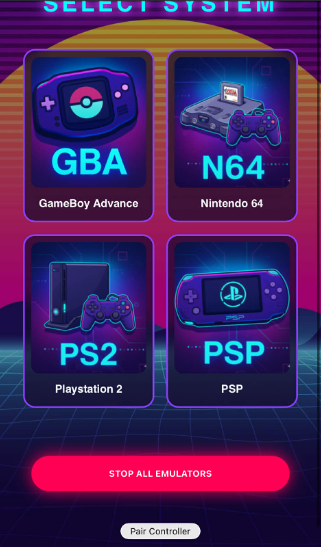
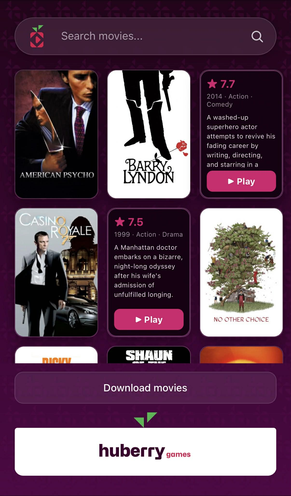
 </p>


## Building the image

Requires Ubuntu 24.04 and [kas](https://kas.readthedocs.io):

```bash
sudo apt update && sudo apt install pipx
pipx install kas
kas build kas-project.yml
```

## Phone controller support

You have the option when playing emulator games to instead of the physical controller you use a simulated controller through your phone. The options and how the controller looks are given below.

<p align="center">
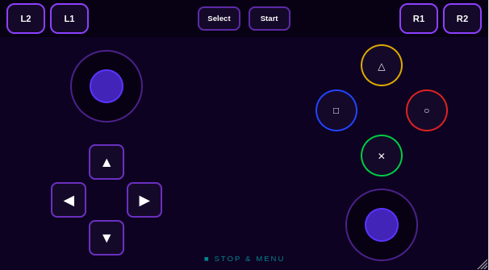
 </p>

<p align="center">
 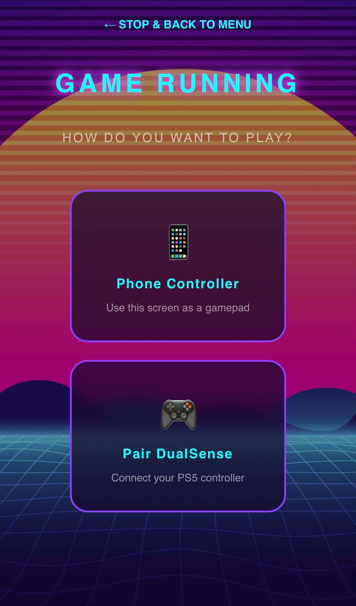
</p>

## VPN support
VPN for cgnat bypass (since my router does not have a static IP) is implemented using the free version of NetBird, allowing the user to access the device on the home network from anywhere via the phone or desktop app.

This is a TODO aswell as the names aren't resolved properly and you have to use the adress.

<p align="center">
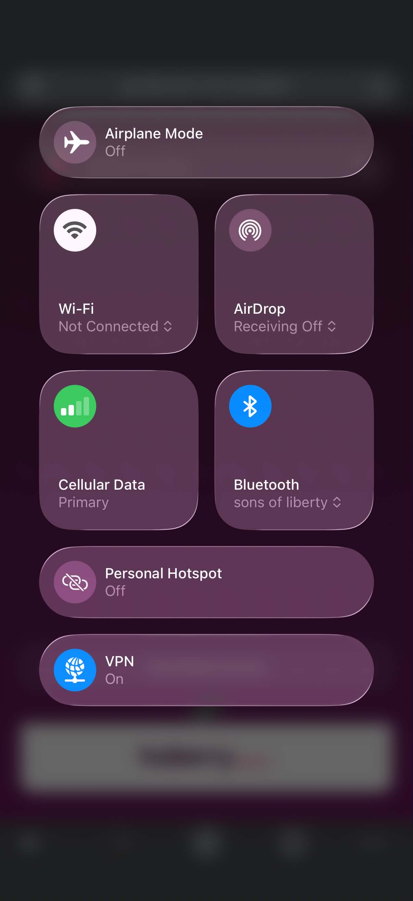
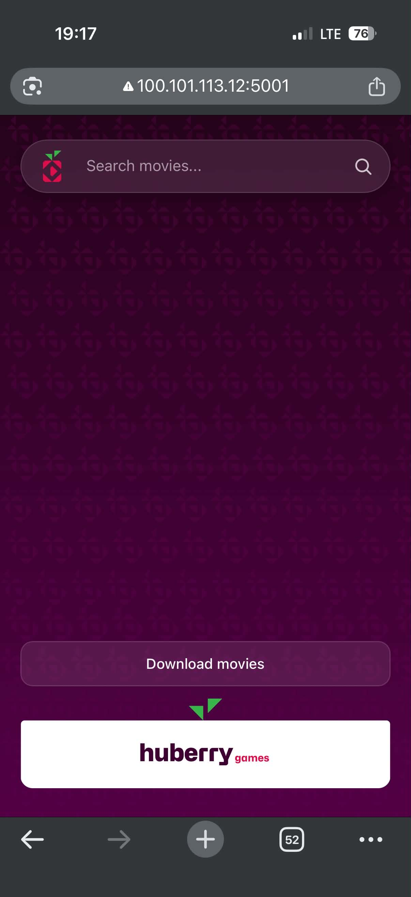
 </p>

## System monitor integration

There is a system monitor as well integrated from the repository I also worked on: https://github.com/Gilgameshgb-1/retro-system-monitor-rpi5

This gives us the option to monitor some parameters, its built originally for my linux locally, but adapted for rpi5 and is cross-compiled together with the webserver which receives WS commands to show important info. Available through `monitor.pi` like the other webservers.

<p align="center">
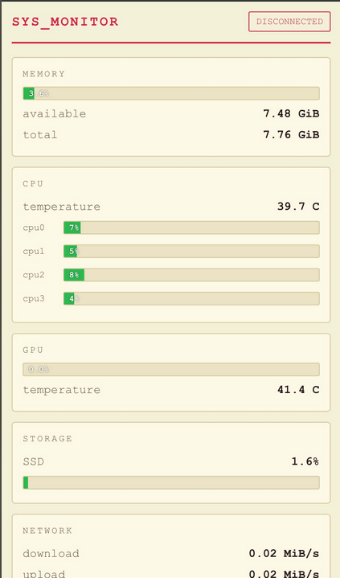
 </p>

## Movie streaming

The streaming interface is powered by [webserver-videoplayer](https://github.com/Gilgameshgb-1/webserver-videoplayer). It lets you search, download, and play movies from your phone, video plays directly on the TV connected to the Pi via HDMI.

### Stream to phone

In addition to playing on the TV, you can stream any movie directly to your phone's browser. Tap **Stream Here** on any movie in the gallery and it opens a full-screen HTML5 video player right on your phone. Subtitle option is supported as well

<p align="center">
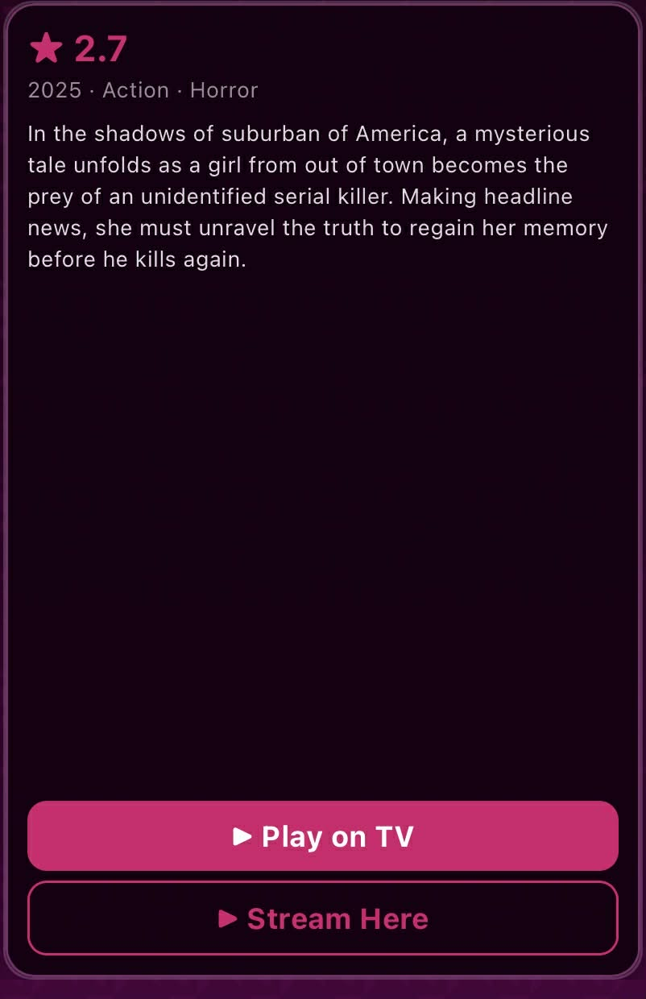
</p>

## Anime library

Movies are one folder, one film. Anime is not - a single torrent is usually a
whole cour - so anime gets its own app with a proper **series -> season ->
episode** structure, per-episode watch state, and a resume button that jumps to
the first unfinished episode. Available at `anime.pi`.

Search runs against [nyaa.si](https://nyaa.si) through its RSS feed, so magnet
links are built locally from the info hash and no `.torrent` files are fetched.
Cover art, synopses and scores come from [AniList](https://anilist.co), cached
to disk so the gallery still renders when the Pi is serving its own hotspot with
no uplink.

Two things it does that the movie player does not:

- **Subtitle and audio menus are read from the file at runtime.** Anime ships
  soft ASS subtitles and dual Japanese/English audio muxed inside the mkv, so
  the track list is pulled from mpv rather than hardcoded.
- **4K releases are checked against what the Pi 5 can actually decode.** The Pi 5
  has a hardware HEVC decoder but no AV1 decoder and no H.264 one, so search
  results warn before you spend 20 GB on something that will not play.

Both apps drive the same mpv instance on the same IPC socket, on purpose: only
one process can own the TV framebuffer, and only one thing plays on the TV at a
time.

Source and developer notes live in [`anime-stream/`](anime-stream/README.md).

<p align="center">
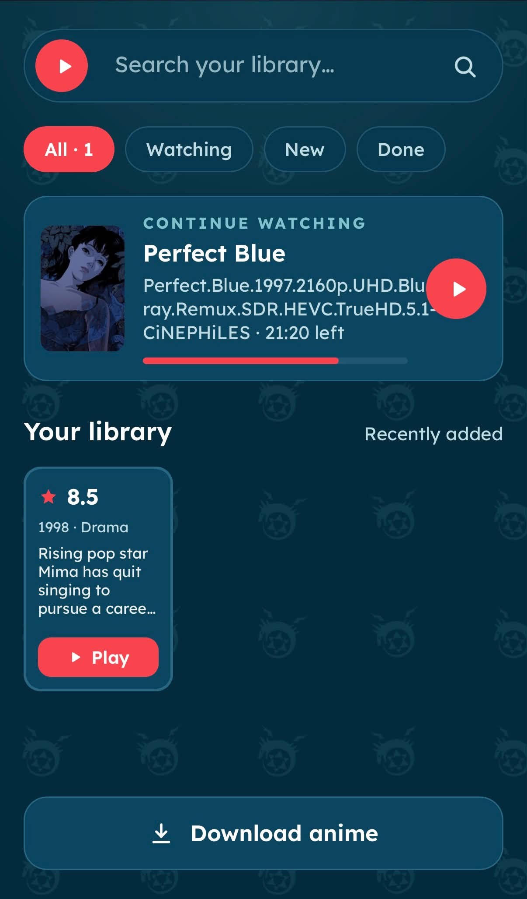
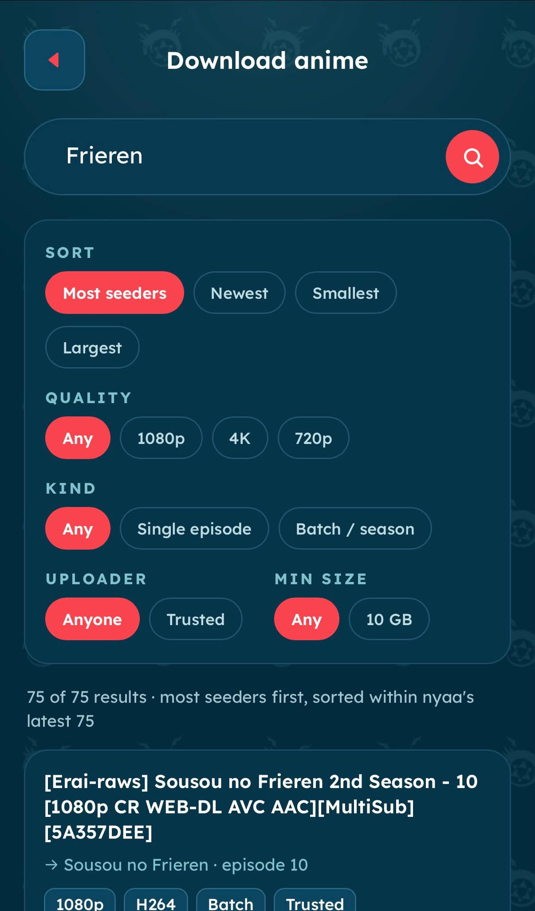
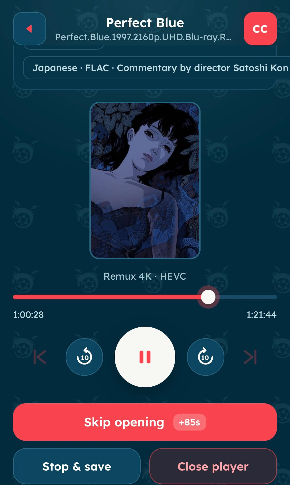
</p>

## Legal Disclaimer

This project is intended for educational and private use only.

**No Firmware/BIOS Included:** This repository does not host, distribute, or provide any proprietary system files, firmware, or BIOS images.

**No Game ROMs/ISO:** No copyrighted game software is included. Users must provide their own legally obtained game backups.

**Trademarks:** Sony® and PlayStation® are registered trademarks of Sony Interactive Entertainment Inc. Nintendo® and all associated console names are trademarks of Nintendo Co., Ltd. This project is not affiliated with, authorized, or endorsed by Sony or Nintendo.